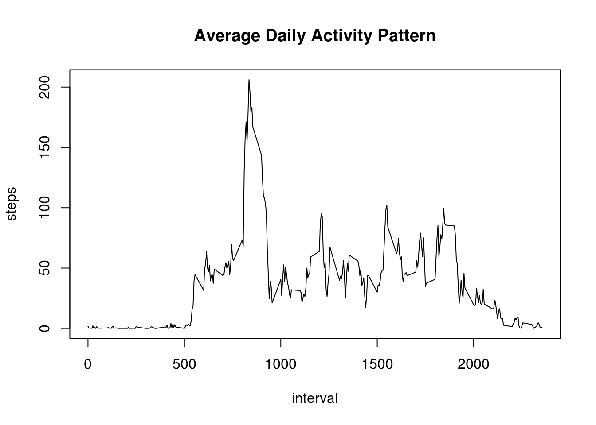

# Reproducible Research: Peer Assessment 1

## Loading and preprocessing the data


```r
act <- read.csv("activity.csv")
```

## What is mean total number of steps taken per day?

We sum the total number of steps for each day and display a histogram of the total number of steps taken each day:


```r
perday <- aggregate(steps ~ date, act, sum)
with(perday, hist(steps))
```

<!-- -->

The mean of the total number of steps taken per day is:


```r
mean(perday$steps)
```

```
## [1] 10766.19
```

And the median of the total number of steps taken per day is:


```r
median(perday$steps)
```

```
## [1] 10765
```

## What is the average daily activity pattern?

We first create the average daily pattern by taking the mean number of steps over each interval, then we plot it as a time series


```r
avgday <- aggregate(steps ~ interval, act, mean)
with(avgday, plot(interval, steps, type = "l", main = "Average Daily Activity Pattern"))
```

<!-- -->

The 5-minute interval that, on average across all the days in the dataset, contains the maximum number of steps is:


```r
avgday$interval[which.max(avgday$steps)]
```

```
## [1] 835
```

## Imputing missing values

The total number of missing values (NAs) is:


```r
sum(is.na(act$steps))
```

```
## [1] 2304
```

To fill in missing values, we use the average daily pattern and imput the mean of the given interval:


```r
act2 <- act
for (i in 1:length(act2$steps)) {
    if(is.na(act2$steps[i]))
        act2$steps[i] = avgday$steps[avgday$interval == act2$interval[i]]
}
```

We can now compare the new estimates of the total number of steps taken each day with the original ones (histogram, mean and median):


```r
perday2 <- aggregate(steps ~ date, act2, sum)
with(perday2, hist(steps))
```

<!-- -->

```r
mean(perday2$steps)
```

```
## [1] 10766.19
```

```r
median(perday2$steps)
```

```
## [1] 10766.19
```

We can note a concentration of the total step taken each day towards the mean calculated initially.
The mean did not change, but the median is now identical to the mean for the new dataset.

## Are there differences in activity patterns between weekdays and weekends?

We first add a factor variable to our new dataset to differenciate "weekday" and "weekend"


```r
act2$date <- as.POSIXct(act2$date)
act2$daytype <- ifelse(weekdays(act2$date, abbreviate = TRUE) %in% c("Sat", "Sun"), "weekend", "weekday")
act2$daytype <- as.factor(act2$daytype)
```

Then we compare the activity pattern of the two:


```r
avgday2 <- aggregate(steps ~ interval + daytype, act2, mean)

library(ggplot2)
qplot(interval, steps, data = avgday2, geom = "line", facets = daytype ~ ., main = "Comparison of Weekday & Weekend Activity Patterns")
```

<!-- -->
